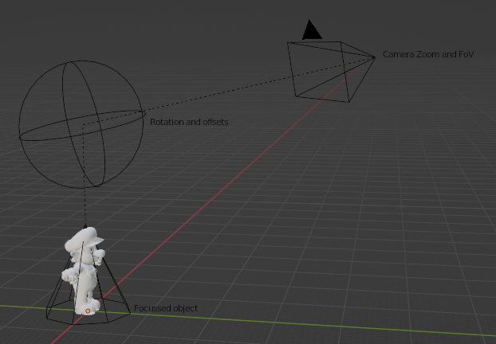
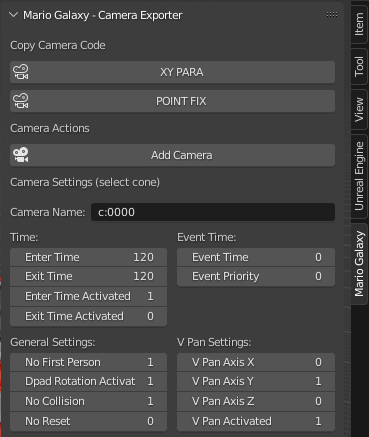

# Super Mario Galaxy - Blender Camera Plugin
Blender plugin with useful functions for *Super Mario Galaxy 2* cameras like copying a camera as code to paste into [LaunchCamPlus](https://github.com/SuperHackio/LaunchCamPlus) (version 2.5.0.0+).

Currently only for the *XY PARA* and *POINT FIX* type.

Planned for new versions are among others the type *TOWER* and *2D SLIDE* as well as the possibility to copy cameras from LaunchCamPlus into Blender.

# How to use it

After installing the plugin, you can find it in the 3D view on the right under the *Mario Galaxy* tab.

Click on *Add Camera* to create the objects needed to create a galaxy camera:

- The cone corresponds to the position of Mario or the focused object (XY PARA) or the fixed position to look at in the level (POINT FIX).
- The sphere is responsible for the rotation and the offsets
- The camera itself is only responsible for the zoom and the FoV (Field of View)

Simply adjust the rotation and position of the sphere and camera object as required. Simply view the camera actively in the 3D view to get exactly the viewing angle that will be used in the game.
Please do not unlock and edit the locked transform parameters.

*Tip:* Use one 3D view for positioning and another with the camera active. You can then also move the cone in the active camera to see how Mario would move with this camera.

Some parameters can be displayed and edited in the tab when the cone object is selected:

- **Camera Name** Name/ID for the camera
- **Time**
  - Enter and Exit duration in frames.
  - Whether it should be activated or not: 1 = Activated, 0 = Deactivated
- **Event Time** Duration and priority of a specific event (for example Launch Star Flights)
- **General Settings**
  - ***No First Person*** Set to 1 to deactivate the first person option in this camera. Set to 0 to enable that
  - ***Dpad Rotation Activated*** Set to 1 to allow rotation of camera via D Pad. Set to 0 to disable that
  - ***No Collision*** Set to 1 to make the camera allow to go through any collision. Set to 0 to disable that
  - ***No Reset*** If this is set to 1 for two cameras, changed Y rotations ingame by the D Pad are adopted between these cameras instead of rotating to the set Y rotation of the camera.
- **V Pan Settings**
  - ***V Pan Axix X, Y, Z*** Allows you to set an Axis as Top, which prevents the camera from immediately moving up with Mario (example: when jumping) on this Axis. Set only one of these axes to 1 and the others to 0. If all are set to 0, the game will still use Y as up, except its disabled:
  - ***V Pan Activated*** Set to 1 to activate it. If set to 0, the camera will follow Mario immediately on any axis, even when jumping.

## Export

When you are happy with the camera select the **cone object** and no other object and click on “XY PARA” or "POINT VIEW" under "Copy Camera Code" in the plugin. In LaunchCamPlus you can now insert the camera by pressing *CTRL + V*. 
