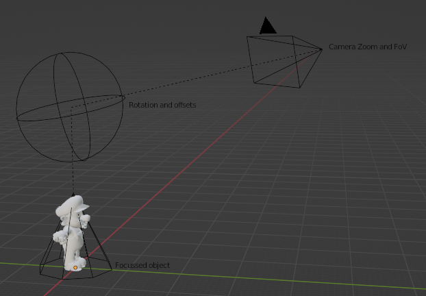
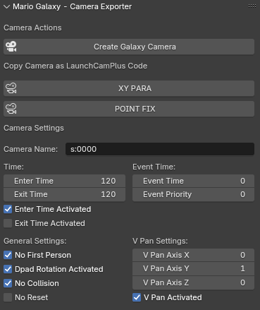
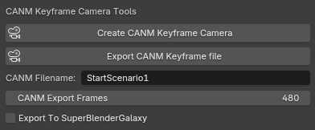
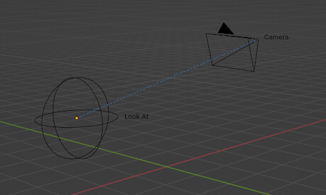
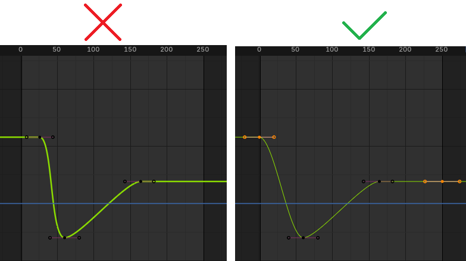

# Super Mario Galaxy - Blender Camera Plugin
Blender plugin with useful functions for *Super Mario Galaxy 2* cameras like copying a camera as code to paste into [LaunchCamPlus](https://github.com/SuperHackio/LaunchCamPlus) (version 2.5.0.0+).
Including CANM Keyframe animation support.

Currently only for the *XY PARA* and *POINT FIX* type.

Planned for new versions are among others the type *TOWER* and *2D SLIDE* as well as the possibility to copy cameras from LaunchCamPlus into Blender.

# How to use it
## Galaxy Cameras
After installing the plugin, you can find it in the 3D view on the right under the *Mario Galaxy* tab.

Click on *Create Galaxy Camera* to create the objects needed to create a galaxy camera:

- The cone corresponds to the position of Mario or the focused object (XY PARA) or the fixed position to look at in the level (POINT FIX).
- The sphere is responsible for the rotation and the offsets
- The camera itself is only responsible for the zoom and the FoV (Field of View)

Simply adjust the rotation and position of the sphere and camera object as required. Simply view the camera actively in the 3D view to get exactly the viewing angle that will be used in the game.
Please do not unlock and edit the locked transform parameters.

*Tip:* Use one 3D view for positioning and another with the camera active. You can then also move the cone in the active camera to see how Mario would move with this camera.

Some parameters can be displayed and edited in the tab when the cone object is selected:

- **Camera Name** Name/ID for the camera
- **Time**
  - Enter and Exit duration in frames.
  - Whether it should be activated or not
- **Event Time** Duration and priority of a specific event (for example Launch Star Flights)
- **General Settings**
  - ***No First Person*** Enable to deactivate the first person option in this camera.
  - ***Dpad Rotation Activated*** Enable to allow rotation of camera via D Pad. 
  - ***No Collision*** Enable to make the camera allow to go through any collision.
  - ***No Reset*** If this is enabled for two cameras, changed Y rotations ingame by the D Pad are adopted between these cameras instead of rotating to the set Y rotation of the camera.
- **V Pan Settings**
  - ***V Pan Axix X, Y, Z*** Allows you to set an axis as "height", which prevents the camera from immediately moving up with Mario (example: when jumping) on this axis. Set only one of these axes to 1 and the others to 0. Set to -1 for inverted axis (e.g. when Mario is on the ceiling). If all are set to 0, the game will still use Y as up, except its disabled:
  - ***V Pan Activated*** If disabled, the camera will follow Mario immediately on any axis, even when jumping.

### Export

When you are happy with the camera select the **cone object** and no other object and click on “XY PARA” or "POINT VIEW" under "Copy Camera Code" in the plugin. In LaunchCamPlus you can now insert the camera by pressing *CTRL + V*. 

## CANM Keyframe Animations

Click on Create **CANM Keyframe Camera** to create the required objects for the animated camera.
It consist of a camera object and a Look At object, which transformations can be animated, except those, that are locked.
FoV can also be animated. For this you need to set the *Lens Unit* of your camera to Millimeters. Roll is defined by the rotation of the Look At object.

**Please note the following when animating:**

- CANM contain keyframes handles, which are only the same size, but can be used either as free or as aligned. If you animate in Blender with interpolation mode Bezier, you get a very similar size of the handles, which you should then rotate, edit individually with free handles, but not scale.
- It is recommended that animated axes/info contain a first and a last keyframe from the first to the last frame of the animation, otherwise a zero value is used for the remaining free time (can vary from game to game):

- If an axe/info is not animated, its current setting or transformation will be exported.

### Export

Select your camera object and enter your filename and animation lenght in the Export Settings and click on **Export** to save it in the same folder as your blend file.
If you use [SuperBlenderGalaxy](https://github.com/Louiskovski/SuperBlenderGalaxy), you can enable the **Export to SuperBlenderGalaxy** to save the CANM directly into your game. You need to have a valid level opened for this.
